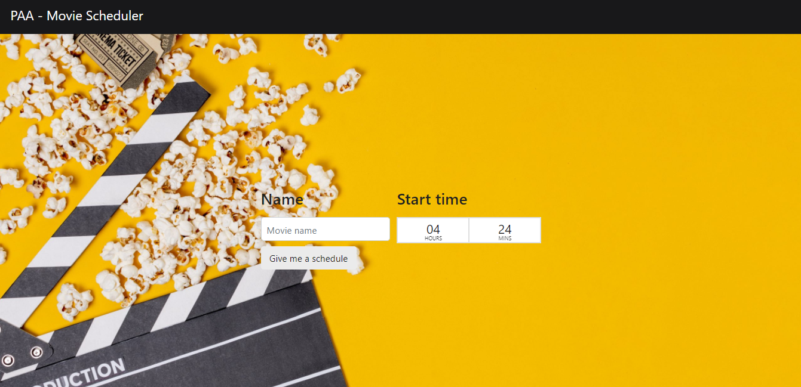
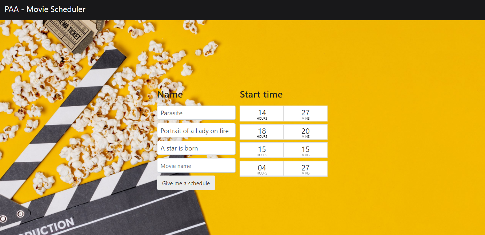
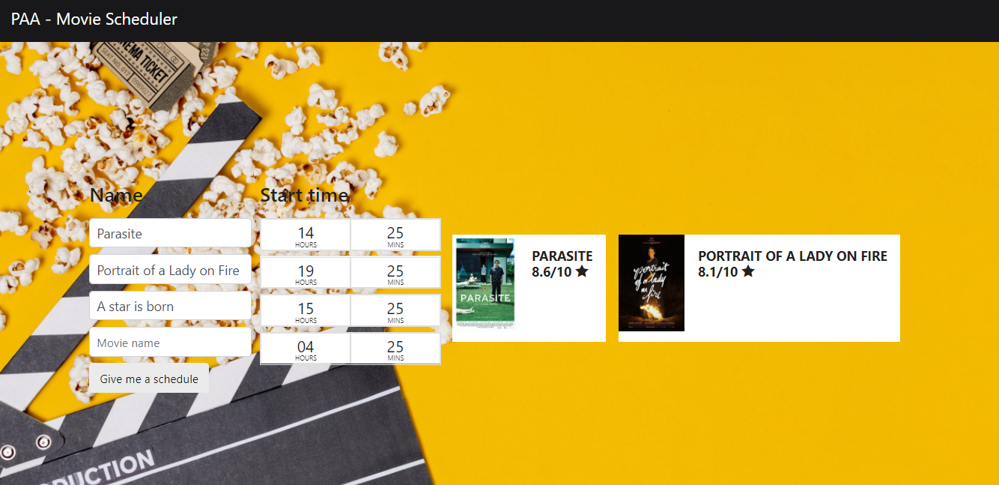

# Movie Scheduler

**Número da Lista**: 5<br>
**Conteúdo da Disciplina**: Programação Dinâmica<br>

## Alunos
|Matrícula | Aluno |
| -- | -- |
| 17/0017885  |  Marcos Nery Borges Júnior |

## Sobre 
Em muitos festivais de cinema é possível comprar um único ingresso que irá te permitir entrar em qualquer sessão durante um dado dia ou semana. Com a promessa da vacina ficando cada vez mais real alguns cinemas já se adiantaram e anunciaram que quando tudo voltar a funcionar eles terão iniciativas como essa para incentivar a volta do consumo desse tipo de entretenimento. 

Dito isso, este projeto visa te ajudar a decidir quais filmes você poderia assistir em um dado dia, pegando todos os horários de sessão que você colocar e gerando o agendamento mais qualitativo possível, levando em conta a duração de cada filme, que é obtida de forma automática. Esse critério de qualidade é representado pela nota média do filme no IMDb. Dessa forma, a aplicação te propõe o agendamento com a maior nota possível, tendo como objetivo te proporcionar os melhores filmes dentre os disponíveis.


## Screenshots




## Instalação 
**Linguagem**: Python<br>
**Framework**: [Flask](https://flask.palletsprojects.com/en/1.1.x/installation/)<br>

Para utilizar o projeto você não precisa instala-lo. Este repositório tem um deploy no Heroku e você pode acessa-lo através da URL abaixo.

https://paa-moviescheduler.herokuapp.com/

Mas, se preferir ver o projeto funcionando localmente, para instalar basta seguir uma das alternativas a seguir:

* Docker: Se você tiver o docker instalado na sua máquina basta executar um ```docker-compose up``` e acessar o seu [localhost na porta 5000](http://localhost:5000/).
* Instalação manual: Para instalar tudo manualmente, basta executar um ```pip install -r requirements.txt``` e em seguida um  ```python web/app.py```, ambos na raiz do repositório. Feito isso a aplicação estará funcionando no localhost na porta indicada no terminal.

## Uso
* Passo 1: Inserir os nomes e horarios de inicio de cada filme. Os nomes devem ser em inglês
* Passo 3: Basta clicar no botão "Give me a schedule" e ver o resultado
* Passo 4: Opcionalmente, você pode clicar em qualquer uma das miniaturas nos resultados para ir até a página do dado filme no IMDb e ler mais sobre ele


